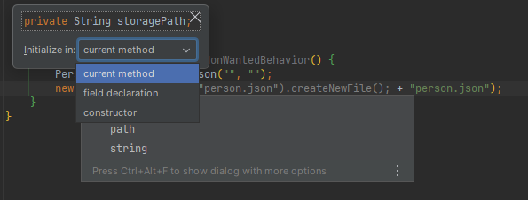
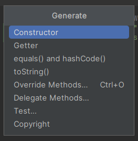
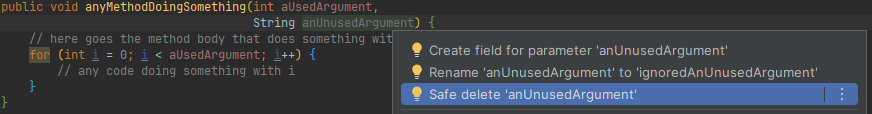
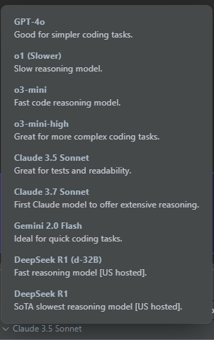

= Spaghetti Code Transformation Guidance
:icons:
:toc: preamble
:figure-caption!:

[abstract]
Dealing with Unstructured-Code Tech Debt, a White Paper to address it

IMPORTANT: This document supposes a codebase in Java, consequently it bases its explanations on Java and its ecosystem. Obviously, that might not be your case, however, the global approach and some explanations are still valuable in some other languages, even though some concepts may not apply to yours (if you deal with a non-object-oriented language particularly).

== Introduction
=== What do we try to solve ?
In the following document, we will give a methodology and explain the path to *transform some unstructured code (also known as spaghetti code) to a structured one*, which means you will end with:

- some more understandable code,
- a clear separation of concern at every depth (method, class, package, module),
- some boundaries between elements, from which an https://fr.wikipedia.org/wiki/Architecture_hexagonale[Hexagonal Architecture] may emerge

Globally, *the intent is to have some human-readable code* that doesn't need a deep read to be understood, that avoids brain overload.

*The methodology also focuses on Unit Testing*, which will protect your code from future unwanted modifications and regressions.

=== For what typology of project?
The methodology works well on *enterprise projects that deal with a lot of business rules* and interacts with other systems (collecting data from them, calling services, sending events, etc.). It might not be applicable to AI, Iot, or Data ones.

The methodology targets projects that have drifted away for several reasons (many stakeholders giving different directions, too many un-experimented developers, extreme delivery-oriented management, loss of knowledge with people departure, etc.), resulting in what we usually call spaghetti code. *Spaghetti code is a symptom of a lack of responsibility and discipline in the code*: elements are not well-named and deal with several different topics.
An extreme example is to have database access directly into your Web layer, which makes you validate the Web arguments, convert them, call the database with the arguments, convert the result back to the caller, and deal with errors, all of this in the controller layer. This is a bad practice because it makes it very hard to test: you need the database up and running, and you have a lot of different topics to test in the same "unit test".
Why is it bad to have non-testable code? because it implies regression, push testing responsibility to QA, requires infrastructure to deliver an up-to-date application for testing, delay feedback to developers, add Pull-Request review, etc.

=== How do we solve it?
Well, it's pretty simple: *go against spaghetti code !* Since we defined it above as a lack of responsibility, we "just" have to treat that point. Obviously, it won't be any easy journey, it will be a long way to go and still requires discipline, but it avoids a Big-Bang (rewriting the whole application) which is much more acceptable from a sponsors and directors point of view.

*The global path is to clarify code about its responsibilities*, here is a representation of it: at the beginning the code is mixed altogether, contexts are tangled, features are intertwined.

.Initial state, code is mixed altogether
[#initial-state-code-is-mixed-altogether]

The continuous refactoring process should "end" to a final state that would look more like this one: contexts emerged from the original structure and they communicate through some contact zones, where interfaces lay.

.Final state: contexts are clearer
[#final-state:-contexts-are-clearer]

=== It's a long journey, requiring habits review
In next chapters we will focus on the day-to-day methodology, but keep in mind that fixing a spaghetti codebase is a *long process that requires a team effort*, as well as a kind of *slow-down of the feature delivery*, and, at least at the beginning, the need to review developer habits. In particular, developers need to train themselves on testing and refactoring, but the more they get trained the more the process will be faster and more efficient, and your codebase tested.

Moreover, the rework of the code mainly deals with decoupling things to settle single responsibilities, which globally means adding abstraction layers. And sometimes, adding abstraction layers seem over-engineering, that's kind of true when speaking about adding a facade-interface in front of a repository or service that doesn't do so much. In such questioning (or developer resistance), I usually answer that:

- adding an interface on top of a repository allows to test the services by invoking it without an up-and-running database,
- •	adding an interface on top of your service allows you to test your controller without having test case data that suit the entire business model rules,
- adding an interface doesn't slow down your development and still let you navigate in the code smoothly because Intellij brings you the unique implementation if you use `Ctrl + Left Click` or `Ctrl + Alt + B`.

It’s also worth to mention that the number of files will inflate, because it is inherent to separate responsibilities in the code: a god class can’t be responsible for one thing.

== The approach
=== The strategy
The global guidance to fixing code is to apply the *Single Responsibility Principal at every level of your codebase*. This means that each method, class, package and module should have its own goal, which is wider and wider going from bottom (method) to top (module).

To make the code responsible for one thing, the first challenge is to *identify its goal*, here begins the methodology: you'll be *helped by tests*. We will see in the <<_step_by_step_journey>> chapter how to do it.

Moreover, since clarification comes often with correctly-named items, we will have to rename some elements, as well as move some lines and rework a bit the code to make it testable. That's why tests are so important here: it is key to protect existing behaviors from being broken (aka regression). Meanwhile, let's be humble, you'll have to make some changes that won't be covered by unit tests. Therefore, don't hesitate to run the app on your own (if possible) or imply the QA team. As mentioned earlier, this is a team effort.

Last element, if naming is insufficient to understand the code, don't hesitate to add a short description to it, which means:

- for a method, add some Javadoc
- for a class, add some Javadoc
- for package, add a README.md
- for a module, add a README.md

==== How to name things?

I highly suggest to *name the code according to features* or business rules at first glance, and then, with technical concept. As well, package, directories or module should be rearranged according to their functional purpose. As a consequence, you should avoid to have a first level of directories named "controller, service, repository, model": this should be a second level of a first one named accordingly to use cases.

Furthermore, a particular attention should be kept on *unit-test method naming*. I encourage voting for a pattern that emphasizes what's being tested, for example:

- the convention "<tested method name>_<input case>_<expectation>" fits the need,
- a phrase stating what's being testing is suitable too.

Here below are some examples for a method that keeps the "N-first" characters of a String, the method is named "head":

[source, java, linenums]
----

// with the convention "<tested method name>_<input case>_<expectation>"
@Test
public void head_sizeIsLessThanStringSize_returnsNFirstStringCharacters() {

}

@Test
public void head_stringInputIsNull_throwsNullPointerException() {

}

// with a phrase stating what's being testing
@Test
public void head_returns_first_n_characters_when_head_size_less_than_string_length() {

}

@Test
public void head_throws_a_null_pointer_exception_when_input_is_null() {

}
----

==== Where to push back code we're not responsible for?

To make emerge a responsibility for our methods and classes, the technique is to push out the code we don't want our classes to deal with, this is *pushing the code "at the edge" of our context and responsibility*. Usually, it means adding a layer of abstraction between our context and one (or more) other context (the actual implementation). For this, you can help yourself with different Design Patterns like Delegation, Adapter, Facade, Inversion of Control, etc. All those techniques mainly consist in introducing:

* a combination of interface and implementation
** interface in our context (asking for some contract),
** implementation out of our context (in another package or module)
* some inheritance: the abstract class in our context, the implementation out of our context (in another package or module) and using the right concrete class at runtime through the factory pattern

The more you push non-relevant code at the edge, the more you make emerge a bounded context for your particular feature or use case, which means that *you're settling on a link:++https://fr.wikipedia.org/wiki/Architecture_hexagonale[Hexagonal Architecture]++[Hexagonal Architecture]*. The goal is that the code outside your context be pushed back in another module. Obviously, it can temporarily be settled in another class or package.

=== Step-by-Step journey
Here below is a quick summary of the methodology:

. *capture behavior*: secure existing code with Unit Testing
. *rework your code* to enhance it while *keeping your tests passing*

This is a high-level overview of the methodology which is close to the https://fr.wikipedia.org/wiki/Test_driven_development[Test Driven Development] approach, but applied to legacy code. In the next chapters we will explain each step in detail.

==== Capturing existing behavior
Here may come the hardest part of the methodology: you need to *capture the behavior of your code*, which actually means *"surrounding it by some unit tests"*. That is known as https://en.wikipedia.org/wiki/Characterization_test[Characterization Test].
However, the code has not been designed for being tested, and you are stuck at writing the first test. Hence, actually, the very first step shall be to open-up a bit the code to make it testable. This can be done in several ways, and here are the few I often use to make the code available for testing.

===== Open-up the code, but not too much
`private` methods can hardly be tested, except with some introspection. Because this way of doing is unsure, I largely prefer some code opening:

. make the `private` method a `package-private` one
. mark it with `@VisibleForTesting` annotation to explain why it is unused out of your test. It can come from Google Guava, or you can make your own, as below
. it is accessible by your test class that is in the same package as the initial class

[source, java, linenums]
----
/**
 * This is a marking annotation to be applied on a class or method to mark it as only exposed for testing purpose.
 * This is only for documentation purpose.
 * This annotation is available in Guava. But since it only a marking interface you may create your own.
 */
public @interface VisibleForTesting {
}
----

===== Overwrite a class "on-the-fly"
Java makes possible to override a class "on-the-fly" to overwrite a method that prevents you from testing a behavior (such as executing an SQL query or static code). Here is an example:

Considering the following class that contains a piece of chaotic code on `difficultMethodToTest()` method which makes impossible to have a determinist test:
[source, java, linenums]
----
public class DummyClass {

    public int methodWhichInvokesSomeBadCode() {
        return 10 * badCode();
    }

    protected int badCode() {
        // this piece of code makes the class barely testable due to the Random invocation due to its non-determinism
        return new Random().nextInt();
    }
}
----

We can override it on-the-fly to stub the problematic behavior:
[source, java, linenums]
----
class DummyClassTest {

    @Test
    void methodWhichInvokesSomeBadCode_useCase4_returns40() {
        DummyClass testInstance = new DummyClass() {
            @Override
            protected int badCode() {
                return 4;
            }
        };
        assertThat(testInstance.methodWhichInvokesSomeBadCode()).isEqualTo(40);
    }
}
----

===== Pushing behavior out of a class
To push behavior out of a class, the approach is to insert some abstraction. I usually use the delegate pattern because it's pretty basic and straightforward: just add an interface around the code you want to push out of our context, and put the implementation on a dedicated class that implements the interface.

To make it, we can use Intellij `Extract Delegate` feature: from the popup that appears, choose the methods to be delegated to another class, then Intellij will create the class. Here is an example starting with the class hereafter:

[source, java, linenums]
----
public class DummyClass {

    public int methodWhichInvokesSomeBadCode() {
        return 10 * badCode() - anotherBadCode();
    }

    public int badCode() {
        // any kind of complex piece of code
    }

    public int anotherBadCode() {
        // any kind of complex piece of code
    }
}
----

After delegation, it gives you the following result:

[source, java, linenums]
----
public class DummyClass {

    private final BadCodeService badCodeService = new BadCodeService(); <1>

    public int methodWhichInvokesSomeBadCode() {
        return 10 * badCodeService.badCode() - badCodeService.anotherBadCode(); <2>
    }

    public int badCode() { <3>
        return badCodeService.badCode();
    }

    public int anotherBadCode() {  <3>
        return badCodeService.anotherBadCode();
    }
}

public class BadCodeService {   <1>
    public BadCodeService() {
    }

    int badCode() {
        // any kind of complex piece of code
    }

    int anotherBadCode() {
        // any kind of complex piece of code
    }
}
----
<1> a new class is created and instantiated
<2> all previous methods are delegated to the new class
<3> previous methods definitions are still present and delegated to the new ones to keep compatibility

Then, combining this result with the `Move initializer to constructor` and `Ctrl + Alt + P` to push it as a constructor argument (see xref:_code_rework_shortcuts[]), you obtain:

[source, java, linenums]
----
public class DummyClass {

    private final BadCodeService badCodeService;

    public DummyClass(BadCodeService badCodeService) { <1>
        this.badCodeService = badCodeService;
    }

    public int methodWhichInvokesSomeBadCode() {
        return 10 * badCodeService.badCode() - badCodeService.anotherBadCode();
    }

    public int badCode() { <2>
        return badCodeService.badCode();
    }

    public int anotherBadCode() { <2>
        return badCodeService.anotherBadCode();
    }
}
----
<1> the delegate has been pushed as a constructor argument to make the class more testable and with less responsibility.
<2> in a second time, calls to the initial code could be replaced by a direct call to the delegate methods, and those methods could be removed.

===== Replace static value with non-static one
The following code contains a reference to a static external constant for a root file path which makes it difficult to test because in a test context the directory may not exist or you may not have access to it, in particular in a CI environment. Therefore, we must authorize the code to get another root path, by replacing the constant reference to a class attribute.

[source, java, linenums]
----
public class PersonService {

	public void persistPersonToFile() {
		Person person = new Person();
        ObjectMapper mapper = new ObjectMapper();
        mapper.writeValue(new File(Configuration.STORAGE_PATH + "person.json"), person); <1>
    }
}

public class Configuration {

    public static final String STORAGE_PATH = "/whatever/path/";
}
----
<1> the root path is hardcoded through the Configuration.STORAGE_PATH constant

As we said, the change is pretty simple: replace the constant by a field variable which is passed to the class constructor. For it, you can use xref:_code_rework_shortcuts[Ctrl + Alt + F], to ask Intellij for a field creation while being on the constant usage. So you obtain:

[source, java, linenums]
----
public class PersonService {

    private final String storagePath;

    public PersonService() {
        storagePath = Configuration.STORAGE_PATH;
    }

    public void persistPersonToFile() {
        Person person = new Person();
        ObjectMapper mapper = new ObjectMapper();
        mapper.writeValue(new File(storagePath + "person.json"), person);
    }
}
----

Then, by using the `Alt + Ins` shortcut you can ask Intellij to introduce a constructor that will get an argument to set the field. Finally, modify the non-arg constructor to call `this(Configuration.STORAGE_PATH)` for constructor code chaining:

[source, java, linenums]
----
public class PersonService {

    private final String storagePath;

    public PersonService() {    <1>
        this(Configuration.STORAGE_PATH);
    }

    public PersonService(String storagePath) { <2>
        this.storagePath = storagePath;
    }

    public void persistPersonToFile() {
        Person person = new Person();
        ObjectMapper mapper = new ObjectMapper();
        mapper.writeValue(new File(storagePath + "person.json"), person);
    }
}
----
<1> the default constructor still makes the instance to use the Configuration constant
<2> this constructor allows to change the root path. If necessary we can limit its access by making in package-private and add a `@VisibleForTesting` annotation

=> We kept initial behavior because we will have a non-arg constructor from which created instances will still use the constant. However, we enhanced the code since it's possible to pass another file path by using the secondary constructor.

===== Change static code to non-static one
In the following dummy code, a check is made to ensure that the application has a the `persistPersonToFile` feature enabled.

[source, java, linenums]
----
public class PersonService {

    public void persistPersonToFile() {
        if (FeatureManager.isEnabled("persistPersonToFile")) { <1>
            Person person = new Person();
            ObjectMapper mapper = new ObjectMapper();
            mapper.writeValue(new File("/whatever/path/person.json"), person);
        }
    }
}

public class FeatureManager {

    public static boolean isEnabled(String featureName) {
        // any kind of implementation
    }

    public static void setEnabled(String featureName) { <2>
        // any kind of implementation
    }

    public static void setDisabled(String featureName) { <2>
        // any kind of implementation
    }
}

----
<1> here lays the problematic static call to the `FeatureManager` class
<2> switching On/Off a feature may not be available which will complexify the test even more

Unfortunately, the check is made by a static call to the `FeatureManager` class which makes it not so easy to test. Even if your project exposes the possibility to switch On and Off a feature, calling those methods before and after your test produces boilerplate code, and you may forget to turn it back to its initial state, therefore impacting the next running tests.

Furthermore, although `Mockito.mockStatic(..)` offers a quick solution for mocking static methods, I recommend addressing the issue of excessive static code by refactoring it to provide long-term benefits (overall design, testability). Let's see how to do it.

Since we want to protect existing code from being broken, we will keep the existing static methods, thus, we will make them be a static wrapper around a unique instance. Hence, we:

1. copy/paste the methods and make them non-static,
2. create a unique instance of the class and make it static so it can be called by the static methods
3. make the original static methods invoke the unique instance
4. fix your class to inject an instance of the adapted class na duse it instead of the old static invocation

Those steps give the following result:
[source, java, linenums]
----
public class PersonService {

    private final FeatureManager featureManager;

    public PersonService(FeatureManager featureManager) {
        this.featureManager = featureManager;
    }

    public void persistPersonToFile() {
        if (this.featureManager.isEnabled("persistPersonToFile")) { <4>
            Person person = new Person();
            ObjectMapper mapper = new ObjectMapper();
            mapper.writeValue(new File("/whatever/path/person.json"), person);
        }
    }
}

public class FeatureManager {

    private static final FeatureManager INSTANCE = new FeatureManager(); <2>

    public static boolean isEnabled(String featureName) {
        return INSTANCE.isEnabled(featureName); <3>
    }

    public static void setEnabled(String featureName) {
        INSTANCE.setEnabled(featureName); <3>
    }

    public static void setDisabled(String featureName) {
        INSTANCE.setDisabled(featureName); <3>
    }

    @VisibleForTesting
    public FeatureManager() {

    }

    public boolean isEnabled(String featureName) { <1>
        // any kind of implementation
    }

    public void setEnabled(String featureName) { <1>
        // any kind of implementation
    }

    public void setDisabled(String featureName) { <1>
        // any kind of implementation
    }
}
----

The good practice is to mark the static methods as `@Deprecated`. Then you can plan a task to migrate the existing code that uses them.

==== Implementing the test
Hopefully, you get some testable code (thanks to previous chapter or not !), so here comes the practises to write your code.

===== Structure your tests
* Inherited from the https://en.wikipedia.org/wiki/Behavior-driven_development[Behavior-driven Development] methodology, the https://en.wikipedia.org/wiki/Given-When-Then[`Given / When / Then`] way of writing tests help developers to structure their test methods. The pattern is quite simple, in your test method:
. create the instance to be tested and fill it with everything necessary, set up other elements also necessary to your tests, this is the `Given` part
. perform the action on the instance you want to test, typically a method invocation with some arguments, this is the `When` part
. finally, add some assertions, this is the `Then` part

* Meanwhile, sometimes we have so many use-cases in one class that it becomes difficult to navigate into the test class. In such circumstances, we can create an internal test class and annotate it with the https://junit.org/junit5/docs/current/user-guide/#writing-tests-nested[JUnit5 `@Nested` annotation].

===== Things to avoid
* A usual mistake is to put some assertions in a loop. This has 2 consequences:
- if the iterated collection is empty, you check nothing
- you generally use some readability, I prefer to use the https://assertj.github.io/doc/#assertj-core-group-assertions[AssertJ contains(...)] method family to check the collection content.

* It's generally advisable to avoid calling the `fail(..)` method directly within exception handling blocks because JUnit already handle exceptions quite efficiently.

* As a reminder, System.out.println(..) is not an assertion.

* Be aware that mocking too many things may hide some behavior that become necessary after some refactoring. Then your test become must more an edge case than a real use-case.

* Avoid mocking with `@MockBean` because it can cause side effects between tests which are hard to detect and fix. Moreover, the usual fix is to come back to a mock per method instead.

* Avoid `@SpringBootTest` because this is clearly no more a unit-test, hence:
. you will have to configure all your application dependencies for your test environment,
. your tests will be much more slower and more resource-intensive that unit-tests ones
It is preferable to use the `@ContextConfiguration(classes = {.. })` annotation, combined with an internal `@Configuration`-annotated class that would initiate some `@Bean`s

===== Data is key
While testing, data is the second nightmare after having testable code. Here are several ways to get some test data.

====== Make your own Builders or Withers
In case of complex business model, a good practice is to help yourself through the Builder Pattern. You will find several ways of implementing it on the Internet, or ask Intellij to generate fluent getters, or use an existing framework such as Lombok to generate them. Meanwhile, all this only offers a fluent API and is hardly extensible. Therefore, I took the habit to implement mine and make it:
- convert fields type to some more suitable ones for the tests,
- propose a constructor with the mandatory parameters,
- chain with other Builders of other entities and POJO

Let's try to apply it to the following POJOs:
[source, java, linenums]
----
public class DummyClass {

    private String name;
    private Date birthDate;
    private Set<AnotherDummyClass> anotherDummyClasses;

    // getters and setters omitted for the sake of brevity
}

public class AnotherDummyClass {

    private File content;

    // getters and setters omitted for the sake of brevity
}
----

We'll start by the creation of a simple banner named `Builder` to clarify our intention:

[source, java, linums]
----
public interface Builder<T> {
	T build();
}
----

Now, let's create a `DummyClassBuilder` to help us create instances of `DummyClass`. It takes the exact same attributes as the target instances, also have fluent setters, but some of them have input types that are more friendly. That way you get some more readable tests.
A particular eye can be put on `Collection`s: exposing them as `Builder`s will help you chain with other dependency.

[source, java, linums]
----
public class DummyClassBuilder implements Builder<DummyClass> {

    private final String name; <1>
    private Date birthDate; <1>
    private Set<Builder<AnotherDummyClass>> anotherDummyClassesBuilders = new HashSet<>();

    public DummyClassBuilder(String name) { <2>
        this.name = name;
    }

    public DummyClassBuilder withBirthDate(Date birthDate) {
        this.birthDate = birthDate;
        return this;
    }

    public DummyClassBuilder withBirthDate(LocalDate birthDate) {   <3>
        return withBirthDate(Date.from(birthDate.atStartOfDay(ZoneId.systemDefault()).toInstant()));
    }

    public DummyClassBuilder withAnotherDummyClasses(Set<AnotherDummyClass> anotherDummyClasses) {
        return withAnotherDummyClassesBuilders(anotherDummyClasses.stream()
                .map(anotherDummyClass -> (Builder<AnotherDummyClass>) () -> anotherDummyClass)
                .collect(Collectors.toSet()));
    }

    public DummyClassBuilder withAnotherDummyClassesBuilders(Set<Builder<AnotherDummyClass>> anotherDummyClassesBuilders) { <4>
        this.anotherDummyClassesBuilders = anotherDummyClassesBuilders;
        return this;
    }

    @Override
    public DummyClass build() {
        DummyClass result = new DummyClass();
        result.setName(name);
        result.setBirthDate(birthDate);
        result.setAnotherDummyClasses(anotherDummyClassesBuilders.stream()
                .map(Builder::build)
                .collect(Collectors.toSet()));
        return result;
    }
}
----
<1> Builder fields matches target class
<2> Constructor with mandatory parameters can be available even if target class doesn't have one
<3> Create methods that help you clarify test code (and maybe business rules)
<4> chain with other Builders of other entities and POJOs

====== Use JUnit 5 @ParameterizedTest
Multiplying test method inputs can be very time-consuming. JUnit 5 provides a way to do it with the `@ParameterizedTest` annotation. It allows you to run the same test method with different inputs.
Not that it also exists for Junit4 as an external library. Here is an example:

[source, java, linenums]
----
public class DummyClass {

    public String myMethodToBeTested(String whoToHello) {
        return "Hello " + whoToHello;
    }
}

class DummyClassTest {

    static Object[][] myMethodToBeTested() {
        return new Object[][]{
                { "world", "Hello world" },
                { "everyone", "Hello everyone" }
        };
    }

    @ParameterizedTest
    @MethodSource <1>
    void myMethodToBeTested(String input, String expectation) {
        DummyClass testInstance = new DummyClass();
        assertThat(testInstance.myMethodToBeTested(input)).isEqualTo(expectation);
    }
}
----
<1> you may also be interested in ArgumentsSource and CsvFileSource

===== Capture behavior with Instancio
https://github.com/instancio/instancio[Instancio] library is very good at capturing behavior: it fills your model objects by random values, then, by adding some assertions on the result of the method you test, you can track the exact impacts of the inputs. Therefore, it helps you decrypt the internal algorithms.
Consequently, this is the best way to ensure that you won't break anything, and it helps you also to better see the consequences of your modification.

===== Capture behavior with Mockito
https://site.mockito.org/[Mockito] offers also a good way to capture values and interactions on methods through the https://site.mockito.org/javadoc/current/org/mockito/ArgumentCaptor.html[ArgumentCaptor] class. Combined with https://site.mockito.org/javadoc/current/org/mockito/Mockito.html#verification[Mockito.verify] it is very handsome to ensure code traversal.

===== Use @TestContainer
Partially-integrated tests can be simpler to implement, especially when working with databases. The https://testcontainers.com/[TestContainer library] facilitates their setup, allowing the shift-left approach for vendor-specific problems. As a result, the QA Team is no longer solely responsible for such integration verification.

==== Final step: rename, move, create on-purpose modules
At this stage we used several techniques to cover the pieces of code we want to change with tests, then we are prepared for some bigger refactoring. So, after committing the code, we are confident to rename, split and move pieces of code. The tests should still pass, however, be humble, this should always be baby steps.

== IDE Key Mapping (Intellij Idea)

Here below are few things that your IDE may do for you, some of them might seem very idiot, but my experience shows me it still worth mentioning them.
Don't forget: the more your practice this shortcut, the more they come a habit.

=== Analysing code

WARNING: If your project is composed of several subprojects of your organization, you should mount them all in the same IntelliJ IDE window. Then you better see the impacts you may have when renaming elements and avoid breaking things. Moreover, if you use the GitToolBox ide plugin (see <<Plugins that may help you>>), it will synchronize branch switching and creation of your several Git repositories, which helps you to create a PR for each of them.

* `Ctrl + Q` to show the quick definition of a method
* `Ctrl + F7`: open a window with your method or class usage. A pretty useful element of the opened window is the "call hierarchy" tab of it, because it let you see what calls your method.
* Follow the errors Luke: sometimes refactoring break things, Intellij might detect it and show you what you've made wrong if you click the red `related problems` tooltip.
* `Alt + F1`: highlight the package / directory your current file is in on the project view (useless if you check the project view synchronization)

=== Code rework shortcuts

* creating an interface from a class is very useful in our context: `right-click on a class > Refactor > Extract interface`
* implementing the Delegate Pattern is also valuable, you can make it through `right-click on a class > Refactor > Extract interface`
* extracting code to make it a new method: `Ctrl + Alt + M` from the selected code
* renaming method, variable, field, class help ou to get code clearer: `Shift + F6`, will cascade the renaming everywhere (stop copy/pasting your renaming)
* creating a field from a variable to make it available at construction time: `Ctrl + Alt + F` while being on the constant usage, then following popup instructions

* the `Alt + Ins` shortcut will bring you a popup with a list of options to generate some code.

* naming a lambda can improve your code readability, to make it here's the procedure:
    ** Alt + Enter on any lambda arguments, choose `Replace lambda by anonymous class`. It generates a "on-the-fly" local implementation of the interface underlying the lambda
    ** On the generated (in place) instantiation, either reuse `Alt + Enter` and choose `Convert to named inner class`, or hit `F6`, then choose the name of your class
* adding an argument to a method: `Ctrl + F6` while the cursor is on the method, it will help you cascade the addition of an argument to your method. All callers will be amended with a parameter, which makes your code doesn't compile, which can be avoided by checking the box "use any var" which may have unexpected consequences. Hence, might help, but use with caution.
* modifying field type can help you give more meaning to your code (from String to Integer, from boxed-type to its primitive equivalent, to avoid primitive obsession, etc.): `Ctrl + Alt + F6` while being on the field
* push a variable as an argument method: `Ctrl + Alt + P`
* put method parameters on separate lines: good for code styling issue, only accessible through `Alt + Enter` on any method argument.
* removing unused code: Intellij warns you about unused code, you can trust him and ask him to remove it for you, it will cascade the removal to callers. Obviously check that the method is not part of a public API, else you have to keep retro-compatibility by keeping a method with same signature but passing any default value to the new one.

* When it finds duplicate code, trust him. No shortcut here, follow the assistant.

=== Test ecosystem shortcuts

* `Ctrl + F5`: re-run last executed tests
* `Ctrl + Shift + F10`: when you are in a test class, run test under your cursor
* `Ctrl + Shift + F5`: navigate between your class and your test class, and vice versa

=== Massive edition shortcuts

* `Ctrl + Alt + L`: reformat code
* `Ctrl + Shift + R`: replace in files
* `Alt + left-mouse-selection` starts the vertical mode edition. Very interesting for massive enum or switch/case edition.

=== Plugins that may help you

* Better code visualization: https://plugins.jetbrains.com/plugin/10080-rainbow-brackets[Rainbow bracket]
* Better Git status visualization (and much more): https://plugins.jetbrains.com/plugin/7499-gittoolbox[GitToolBox]
* Converting JUnit assertions to AssertJ ones: https://plugins.jetbrains.com/plugin/10345-assertions2assertj[Assertions2Assertj]
* https://plugins.jetbrains.com/plugin/21206-qodo-gen[Qodo Gen], yet another AI assistant, but I like its UI integration: mouse click for test generation, code explanation, and so on. I also like the way it generates tests at first glance: a "happy path" and a "edge case". You can also choose the AI engine you want. Meanwhile, it's still an AI, use with caution.

* https://plugins.jetbrains.com/plugin/7160-camelcase[CamelCase] for easy switch between kebab-case, SNAKE_CASE, PascalCase, camelCase, snake_case or space case.
